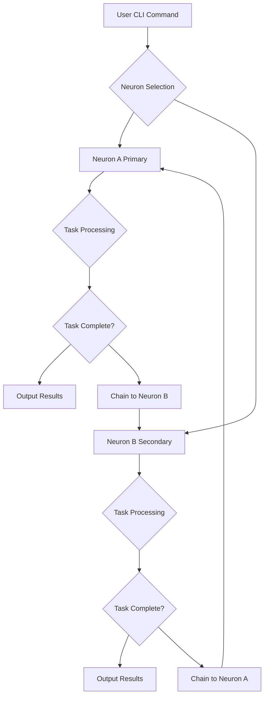
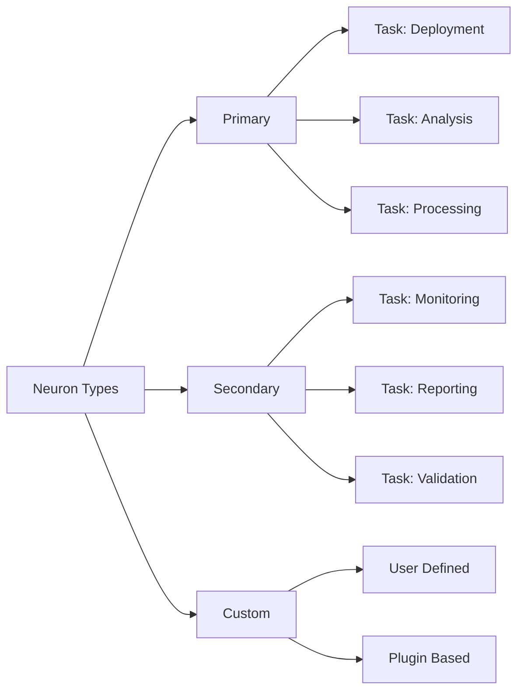
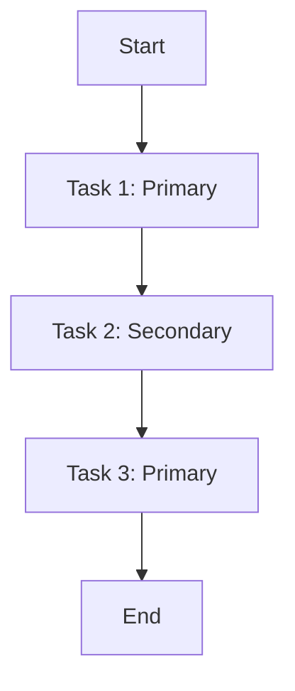

# Two Neurons - DevOps CLI

A powerful CLI tool for orchestrating two neural networks for DevOps workflows.

## Installation

```bash
pip install https://github.com/hallucinaut/two-neurons
```

## Quick Start

```bash
# Initialize the project
two-neurons init

# Run a simple task
two-neurons run --task "analyze_security"

# Check status
two-neurons status
```

## Architecture



## Usage Examples

### Basic Task Execution

```bash
# Run a task on Neuron A
two-neurons run --task "deploy" --neuron primary

# Run a task on Neuron B
two-neurons run --task "monitor" --neuron secondary

# Run task on both neurons
two-neurons run --task "backup" --neuron both
```

### Workflow Chaining

```bash
# Chain operations: Primary → Secondary
two-neurons chain --from primary --to secondary --task "analyze_logs"

# Chain operations: Secondary → Primary
two-neurons chain --from secondary --to primary --task "optimize_config"

# Create complex workflow
two-neurons workflow create --name "security_audit"
two-neurons workflow add --name "security_audit" --step "primary" --task "scan"
two-neurons workflow add --name "security_audit" --step "secondary" --task "report"
two-neurons workflow run --name "security_audit"
```

### Configuration Management

```bash
# View configuration
two-neurons config show

# Update settings
two-neurons config set --key "timeout" --value "300"

# View neuron status
two-neurons status --neuron primary
two-neurons status --neuron secondary
```

## Workflow Diagram


## Neuron Types



## Command Reference

### Core Commands

| Command | Description |
|---------|-------------|
| `init` | Initialize project configuration |
| `run` | Execute a single task |
| `chain` | Chain tasks between neurons |
| `workflow` | Manage workflows |
| `status` | Check system status |
| `config` | Configuration management |

### Task Examples

```bash
# Security Operations
two-neurons run --task "vulnerability_scan"
two-neurons run --task "compliance_check"

# Infrastructure Operations
two-neurons run --task "deploy_service"
two-neurons run --task "scale_resources"

# Monitoring Operations
two-neurons run --task "health_check"
two-neurons run --task "log_analyze"
```

## Advanced Usage

### Custom Neuron Configuration

```json
{
  "neurons": {
    "primary": {
      "endpoint": "https://api.primary.example.com",
      "model": "gpt-4",
      "timeout": 300
    },
    "secondary": {
      "endpoint": "https://api.secondary.example.com",
      "model": "gpt-3.5",
      "timeout": 180
    }
  }
}
```

### Workflow Definition



## Project Structure

```mermaid
graph TD
    A[two-neurons] --> B[bin]
    A --> C[lib]
    A --> D[config]
    A --> E[examples]
    A --> F[docs]

    B --> G[two-neurons]
    C --> H[core]
    C --> I[plugins]

    H --> J[neuron.py]
    H --> K[executor.py]
    H --> L[chain.py]

    D --> M[two-neurons.json]
    D --> N[config.schema.json]

    E --> O[examples.md]
    E --> P[tasks.yaml
```

## Development

```bash
# Clone the repository
git clone https://github.com/hallucinaut/two-neurons.git
cd two-neurons

# Install dependencies
pip install -r requirements.txt

# Run development server
python -m two_neurons

# Build for production
python setup.py install

# Run tests
pytest
```

## License

MIT License - see LICENSE file for details

## Contributing

Contributions are welcome! Please read our contributing guidelines before submitting pull requests.
